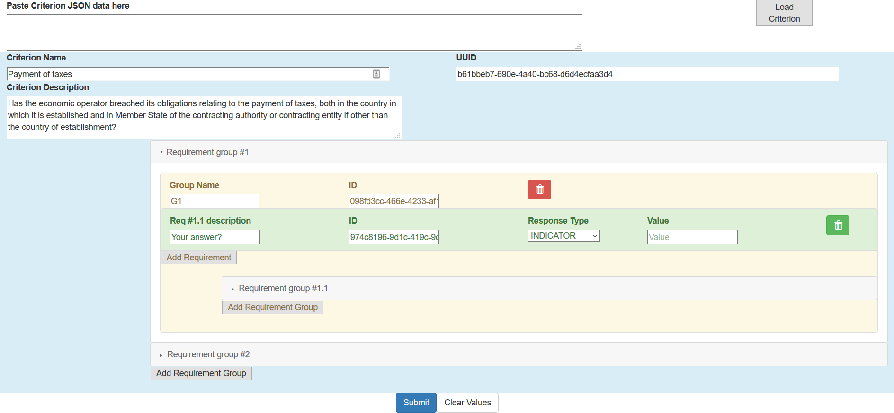

# ESPD Criteria Builder

## Introduction

Create or import [ESPD](https://github.com/ESPD/ESPD-Service) criteria structure and generate 
[ESPD Exchange Data Model](https://github.com/ESPD/ESPD-EDM) `XML` samples.



## Requirements

* [Java Development Kit 8](http://www.oracle.com/technetwork/java/javase/downloads/jdk8-downloads-2133151.html)
* [Maven 3](https://maven.apache.org/download.cgi)
* [NodeJS 7 & NPM 4](https://nodejs.org/en/)
* [Facebook Yarn (optional)](https://yarnpkg.com/en/docs/install)

## Run in development mode

From the `react-client` module run one of the following commands to install the JS dependencies:

```yarn install``` or ```npm install```.

1. Start the Java server for the XML generation by running the `com.vigi.ServerApplication` class.

2. Start the JS client: ```yarn run start``` or ```npm run start```.

3. Access the application at: [http://localhost:3000](http://localhost:3000).

## Run in production mode

1. Invoke a `mvn clean package`.

2. From the `server/target` folder run `java -jar server-0.0.1-SNAPSHOT.jar`.

3. Access the application at: [http://localhost:8080](http://localhost:8080).